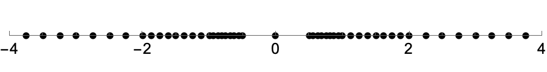
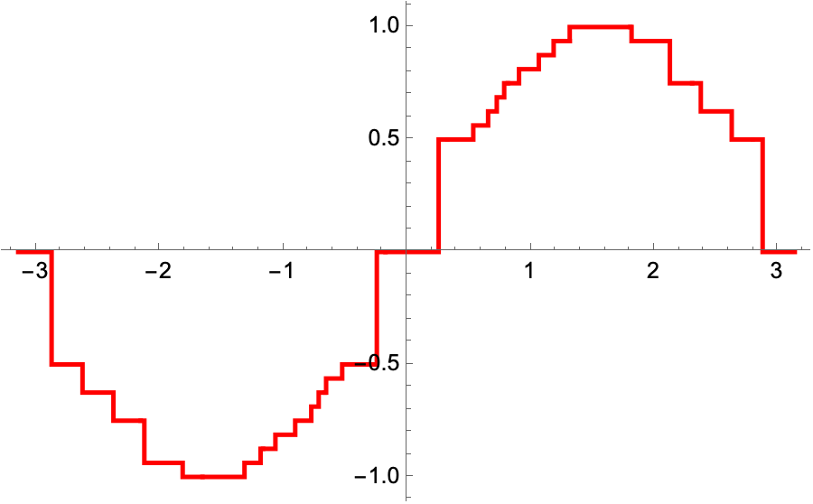

# Task1 — Исследование конечной системы чисел с плавающей точкой.

> Все исходные данные находятся в файле [Task1.nb](/HW1/Task1/Task1.nb)
> (PDF-версия - [Task1.pdf](/HW1/Task1/Task1.pdf))

## Цель

Построить множество представимых чисел при заданной длине мантиссы и диапазоне экспоненты, вычислить ключевые параметры (UFL, OFL, eps_m), реализовать модель округления к ближайшему представимому числу и проанализировать результат на примере функции `sin(x)`.

## Параметры системы

- длина мантиссы `m_len = 3` (число знаковых разрядов мантиссы),
- экспонента `a` берётся из набора `{-1, 0, 1}` (то есть рассматривается диапазон степеней 2^a),
- нормализованная мантисса генерируется как

> Представление имитирует упрощённую модель плавающей точки с фиксированной длиной мантиссы.

## Шаг 1. Построение множества представимых чисел

1. Генерируем набор мантисс: `mantiss = {1, 1+1/8, 1+2/8, ...}` (шаг = 1/2^m_len). Для m_len=3 шаг равен 1/8 = 0.125.
2. Генерируем набор степеней двойки: `2^a` с `a ∈ {-1, 0, 1}` => `{1/2, 1, 2}`.
3. Перемножаем все мантиссы на все степени двойки (операция `Outer[Times, mantiss, 2^a]`), чтобы получить положительные представимые числа в разных диапазонах: `[mantissa]*2^exp`.
4. Берём объединение (`Union`) и дополняем знаками `{..., -values, 0}` — получаем симметричное множество `allNumbersSigned`.

```mathematica
mLen = 3;
a = {-1, 0, 1};
mantiss = Range[1, 2 - 1/2^mLen, 1/2^mLen];
allNumbers = Union[Flatten[Outer[Times, mantiss, 2^a]]];
allNumbersSigned = Union[Flatten[{allNumbers, -allNumbers, {0}}]];
```



## Шаг 2. Нахождение UFL, OFL, eps_m

- `UFL` (Underflow Level) — минимальное положительное представимое число: `Min[Select[allNumbersSigned, # > 0 &]]`. В результате получилось `1/2`.
- `OFL` (Overflow Level) — максимальное представимое число:
  `Max[allNumbersSigned]`. Результат: `15/4 = 3.75`.
- `EpsM` (машинный эпсилон) — максимальное число, которое при прибавлении к единице получается единица: `(Min[Select[allNumbersSigned,#>1&]] - 1)/2`.

```mathematica
UFL = Min[Select[allNumbersSigned, # > 0 &]];
OFL = Max[allNumbersSigned];
EpsM = (Min[Select[allNumbersSigned, # > 1 &]] - 1)/2;
```

## Шаг 3. Модель округления (RoundModel)

Реализовали функцию

```mathematica
RoundModel[x_] := First@Nearest[allNumbersSigned, x];
```

которая для любого вещественного `x` возвращает ближайшее представимое значение из множества `allNumbersSigned`.

## Шаг 4. Округление функции sin(x) и визуализация

1. `f[x_] := RoundModel[Sin[RoundModel[x]]]` — это округленная версия синуса.
2. График синуса в данной модели:




**На графике:** Вместо гладкой синусоиды получается ступенчатая кривая: значения `sin(x)` округляются к ближайшей ступени множества представимых чисел.
