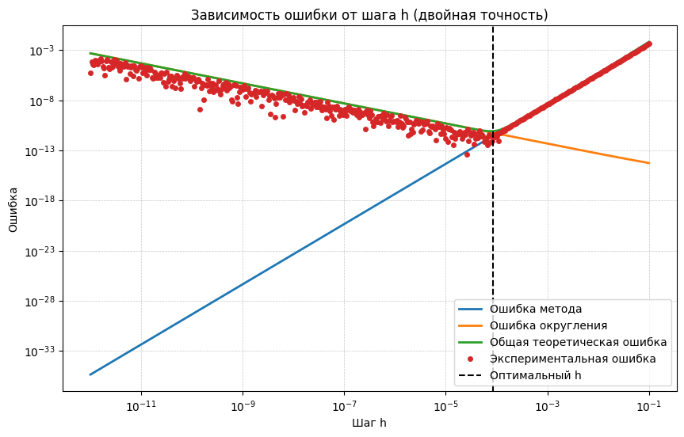
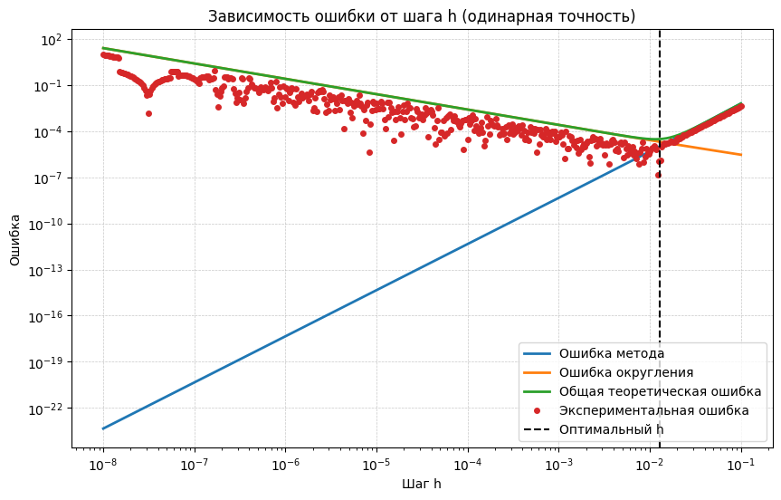

# Task2 — Аппроксимация производной с помощью линейной комбинации значений функции и анализ погрешности.

> Все исходные данные находятся в файле [Task2.nb](/HW1/Task2/Task2.nb)
> (PDF-версия - [Task2.pdf](/HW1/Task2/Task2.pdf))
> Построение графиков находится в файле [Task2.ipynb](/HW1/Task2/Task2.ipynb)

## Цель

Дан шаблон функции:
$$f'(x) \approx a f(x+2h) + b f(x-h) + c f(x-2h) + d f(x-3h)$$
- На заданом шаблоне получить формулу численого дифференцирования, которая точна для функции $g(x) = cos(2x)$ и имеет максимально возможный порядок аппроксимации.
- Вывести выражение для оценки ошибки численного дифференцировании с учетом погрешности округлений. Получить аналитическое выражение для $h_{opt}$ - оптимального шага численного дифференцирования и соответствующей ему ошибки дифференцирования.
- Программно реализовать полученную формулу численного дифференцирования для вычисления соответствующей производной функции $f'(x) = sin^2(x)$ в точке $x_0 = \frac{\pi}{8}$.
- Постройть на одном графике экспериментальную и теоретическую зависимости ошибки от шага численного дифференцирования при использовании арифметики с плавающей точкой одинарной и двойной точности. Сделать вывод о соответсвтии теоретической оценки результатам численных расчетов экспериментов.

## Реализация

### Представление через ряды Тейлора и точность для `g(x)`
Для получения точности на $g(x) = cos(2x)$ просто подставим все в шаблон:
`(cos(2x))' = a cos(2(x+2h)) + b cos(2(x-h)) + c cos(2(x-2h)) + d cos(2(x-3h))`
Вычисляем производную, раскрываем суммы и разности косинусов, приводим подобные по `cos(2x)` и `sin(2x)`. Получаем следующую систему условий на коэффициенты

$$
\begin{cases}
a cos(4h) + b cos(2h) + c cos(4h) + d cos(6h) == 0 \\
-a sin(4h) + b sin(2h) + c sin(4h) + d cin(6h) == -2
\end{cases}
$$

Получается, если коэффициенты удолетворяют системе, то формула точна для `g(x)`.

Теперь возмем шаблон и разложим его по степеням `h`.
Далее свободный член прировняем к нулю, а коэффициент прировняем к единице.
Таким образом получается еще два условия для аппроксимации производной функцией.
Добавление условия равенства нулю при второй производной коэффициента делает систему нерешаемой.

Решая систему из условий точности на `g(x)` и коэффициентов получаем сами коэффициенты:

$$
\begin{cases}
a = \dfrac{-2h\cos(4h) + \sin(2h)}{h\left(4\sin(2h) - \sin(8h)\right)}, \\
b = -\dfrac{(1 + 2\cos(2h) + 2\cos(4h))\csc^3(h)(-4h + \sin(4h))}{8h\left(6\cos(h) + 3\cos(3h) + \cos(5h)\right)}, \\
c = \dfrac{-8h - 16h\cos(2h) - 6h\cos(4h) + \sin(2h) + 2\sin(4h) + 2\sin(6h) + \sin(8h)}{h\left(4\sin(2h) - \sin(8h)\right)}, \\
d = -\dfrac{(1 + 2\cos(2h))\csc^3(h)(-4h + \sin(4h))}{8h\left(6\cos(h) + 3\cos(3h) + \cos(5h)\right)}
\end{cases}
$$

Код реализации:

```matematica
g[x_] := Cos[2 x];
approxExpr = a f[x + 2 h] + b f[x - h] + c f[x - 2 h] + d f[x - 3 h];

dec = Normal[Series[approxExpr, {h, 0, 3}]];
eqGeneral = {
   Coefficient[dec, f[x]] == 0,
   Coefficient[dec, f'[x]] == 1,
   a Cos[4 h] + b Cos[2 h] + c Cos[4 h] + d Cos[6 h] == 0,
   a Sin[4 h] - b Sin[2 h] - c Sin[4 h] - d Sin[6 h] == 2};

sol = First[Solve[eqGeneral, {a, b, c, d}]] // FullSimplify
```

#### Порядок аппроксимации

Из шаблона вычтем значение производной функции и разложим все по Тейлору.
Порядок ведущего члена ряда и будет порядком аппроксимации.

```matematica
err = Series[approxF - D[f[x], x], {h, 0, 5}] // Normal
n = Select[Range[0, 6], SeriesCoefficient[err, {h, 0, #}] =!= 0 &][[1]];
```

Получаем 

$\frac{2}{3} h^3 \left(4 f''(x) + f^{(4)}(x) \right) - \frac{13}{30} h^4 \left(4 f^{(3)}(x) + f^{(5)}(x) \right) + \frac{2}{45} h^5 \left(64 f''(x) + 44 f^{(4)}(x) + 7 f^{(6)}(x) \right) $

А значит мы получили порядок аппроксимации $O(h^3)$

### Оценка верхних границ модулей коэффициентов
Для учёта погрешности округления необходимы выражают верхние оценки модулей коэффициентов. Разложим их в ряд по `h` в окрестности 0, что даёт асимптотические оценки вида `const / h` (характерно: коэффициенты растут при уменьшении `h`, что увеличивает влияние ошибок округления).

Получаем
- `|a| <= 11/(60 h)`
- `|b| <= 2/(3 h)`
- `|c| <= 5/(4 h)`
- `|d| <= 2/(5 h)`
Итого
- `(|a| + |b| + |c| + |d|) <= 5/(2 h)`

### Погрешности: теоретическая аппроксимация и погрешность округления
Разделяют ошибку на две составляющие:
1. **Эпсилон-аппроксимационная часть (Et)** — погрешность аппроксимации, обусловленная усечённой частью ряда Тейлора. $E_t =  \frac{2h^3 \cdot (4f^{(2)}(x_0)+f^{(4)}(x_0)}{3})$, где $f^{(2)}(x_0)$ и $f^{(4)}(x_0)$ - вторая и четвертая производная в точке $x_0$
2. **Погрешность округления (Er)** — обусловлена машинной точностью `eps` и коэффициентами:
$E_r \approx \varepsilon(|a|f(x+2h) + |b|f(x-h) + |c|f(x-2h)+ |d|f(x-3h))$
Ограничим функцию f(x) константой M на промежутке от $[x-3h,x+2h]$
Тогда $E_r \approx \varepsilon M(|a| + |b| + |c| + |d|) = \varepsilon \cdot M \cdot \frac{5}{2h}$.

Итоговая оценка: `Es[h, eps] = Et[h] + Er[h, eps]` = $\frac{2h^3 \cdot (4f^{(2)}(x_0)+f^{(4)}(x_0))}{3} + \varepsilon \cdot M \cdot \frac{5}{2h}$.

### Оптимизация шага h
Найдем `h_opt`, минимизирующий сумму аппроксимационной и округлительной погрешностей. 
Для этого должно выполняться `dE/dh = 0`:
$\frac{dE}{dh} = -\frac{5\varepsilon M}{2h^2} + (2h^2 \cdot (4f^{(2)}(x_0)+f^{(4)}(x_0))) = 0$

Получаем $h_{opt}(\varepsilon) = \sqrt[4]{\frac{5\varepsilon M}{2 \cdot (4f^{(2)}(x_0)+f^{(4)}(x_0))}}$
Заменив `eps` значениями для double и single precision получим численные `h_opt`.

### Численные значения
Возьмем конкретную функцию `f(x) = cos^2(x)` и точку `x0 = π/8`.

Подстановкой получим:
- $h_{opt} (double) \approx 8.36939 \cdot 10^{-5}$
- $h_{opt} (single) \approx 1.27397 \cdot 10^{-2}$
- $E_{min} (double) \approx 6.56636 \cdot 10^{-12}$
- $E_{min} (single) \approx 2.34365 \cdot 10^{-5}$

Построем лог-лог графики экспериментальной ошибки и теоретической оценки `Es[h, eps]` в зависимости от h от для различных `eps` соответствующих одиночной и двойной точности.




## Итоговые выводы
- Схема имеет порядок `O(h^3)` — теоретически ошибка аппроксимации убывает как `h^3` при малых h.
- Однако при слишком малых h растёт вклад ошибки округления (из-за больших коэффициентов ~1/h), поэтому существует оптимальный шаг `h_opt`.