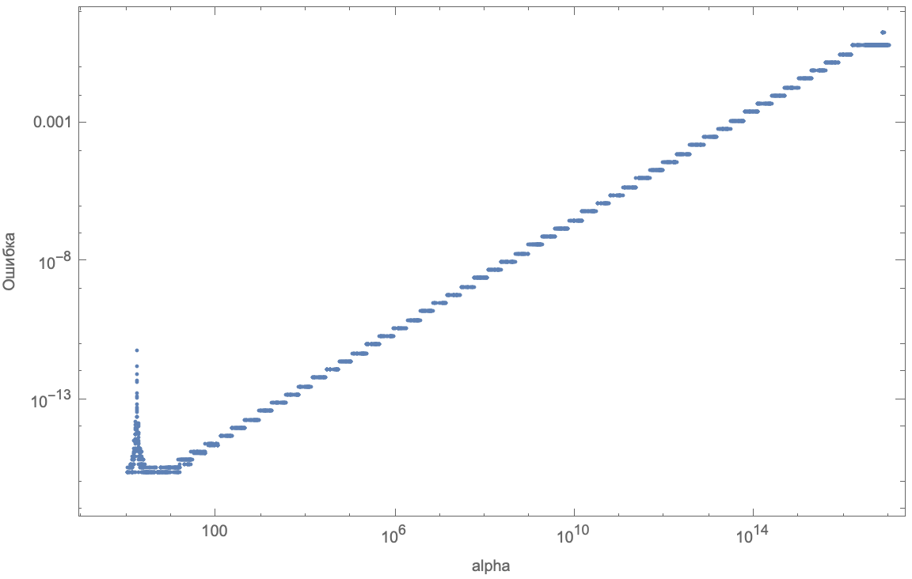
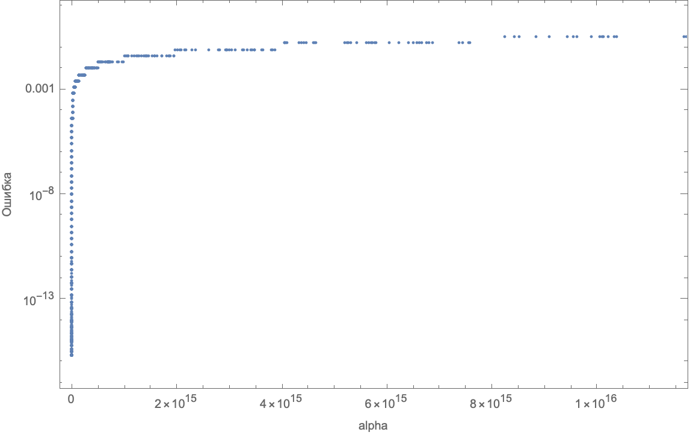

# Task3 — Численное решение кубического уравнения методом Кардано

> Все исходные данные находятся в файле [Task3.nb](/HW1/Task3/Task3.nb)
> (PDF-версия - [Task3.pdf](/HW1/Task3/Task3.pdf))

## Задача
Рассматривается кубическое уравнение
$ x^3 + 3 x^2 + a^2 x + 3 a^2 = 0 $
Которое можно разложить на множители

$ (x + 3)  (x^2 + a^2) = 0 $
Поэтому $x_{true} = -3$ — точный вещественный корень для **всех** `a`.

## Цель
Исследуем численную процедуру извлечения корня при помощи формулы Кардано и оценим относительную погрешность $|\frac{x_{numeric}}{x_{true}} - 1|$ как функцию параметра `alpha`.

## Применение формулы Кардано
Чтобы применить формулу Кардано, приводим уравнение к каноническому виду `y^3 + py + q = 0` через замену `x = y - a/3` (в общем случае). Реализована функция `rootRe[alpha]`, которая по параметру `alpha` рассчитывает следующие величины:
- `a = 3.`,
- `b, c, p, q`,
- `s = Sqrt[(p/3)^3 + (q/2)^2]`,
- `y = cubeRoot(-q/2 + s) + cubeRoot(-q/2 - s)`,
- итоговый корень `x = y - a/3`.

```mathematica
rootRe[alpha_?NumericQ] := Module[{a = 3., b, c, p, q, s, y},
  b = alpha^2;
  c = 3 alpha^2;
  p = b - a^2/3.;
  q = c - a b/3. + 2 (a/3.)^3;
  s = Sqrt[(p/3.)^3 + (q/2.)^2];
  y = cubeRoot[-q/2. + s] + cubeRoot[-q/2. - s];
  y - a/3.
];
```

Функция `cubeRoot[z_]` определена с учётом знака, чтобы корректно брать вещественный кубический корень: `Sign[z]*Abs[z]^(1/3)`.

```mathematica
cubeRoot[z_?NumericQ] := Sign[z]*Abs[z]^(1/3);
```

## Анализ при различных `alpha`
1. Зафиксирован `x_true = -3` (как аналитический корень).
2. Для каждого `alpha` вычисляется `x_numeric = rootRe[alpha]` и абсолютная ошибка `|x_numeric - x_true|` сохраняется.
3. Построены графики `ListLogLogPlot` и `ListLogPlot` ошибки vs `alpha`.

## Графики
- Для малых значений `alpha` (порядка 1) алгоритм возвращает точный корень `-3` с очень малой ошибкой (механизм Кардано устойчив).
- Для больших `alpha` наблюдается рост ошибки, на лог-лог графике видно, где начинает доминировать машинная ошибка и насколько она зависит от `alpha`.

### LogLog график



### LogLinear график


